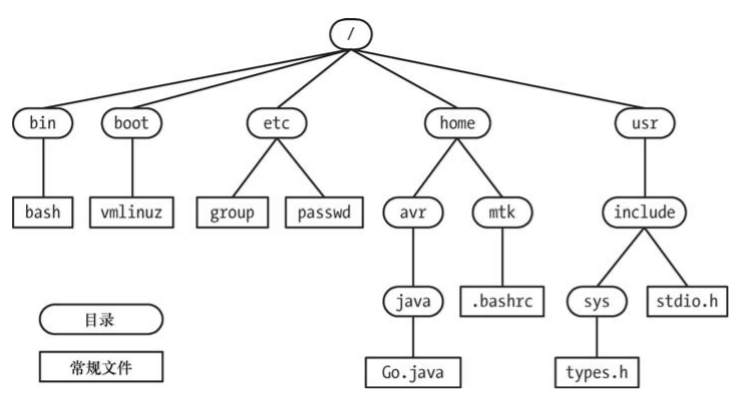

# 第02章 基本概念

## 2.1 内核

### 2.2.1 内核的职责

* 创建进程：把程序载入内存，提供其所需要的资源（CPU、内存、文件访问等）。
* 终止进程：进程执行完毕，释放其所占用的资源（CPU、内存、文件访问等）。
* 进程调度：抢占式多任务操作系统，把CPU资源分片，分给需要的进程使用。
* 内存管理：虚拟内存管理机制，公平高效的在进程间分享内存资源。
* 文件系统：提供文件系统抽象概念，对磁盘资源进行管理。
* 设备访问：计算机的外接设备，如（鼠标、键盘、光驱等）。
* 编程接口：应用编程接口（API），利用内核入口点（系统调用）让内核取执行各种任务。
* 网络连接：以用户进程的名义发送和接受网络数据包。

### 2.2.2 内核态和用户态

- CPU的运行分为用户态和核心态，执行硬件指令可在两种状态间切换。
- 通过虚拟内存标记，内存分为用户空间部分和内核空间部分。
- 用户态只能访问用户空间部分的内存。核心态可访问所有内存。
- 仅当处理器在核心态时，才能执行某些操作，如（宕机、访问内存管理硬件，设备I/O操作的初始化等）。

## 2.2 Shell

一种具有特殊用途的程序，本质上是一个进程。Shell读取用户输入的命令，调用命令对应的程序。

* Bourne shell（sh）：最古老的，UNIX7的标配shell。
* C shell（csh）：语法和C语言很相似，BSD系统标配shell。
* Korn shell（ksh）：Bourne shell的继承者，吸收了很多csh的特性。
* Bourne again shell（bash）：GNU组织对Bourne shell的复刻版，Linux系统标配shell。

## 2.3 用户和组

| 用户文件       | ```/etc/passwd```                                |
| -------------- | ------------------------------------------------ |
| 用户密码文件   | ```/etc/shadow```                                |
| 用户组文件     | ```/etc/group```                                 |
| 用户组密码文件 | ```/etc/gshadow```                               |
| 用户配置文件   | ```/etc/login.defs``` ```/etc/default/useradd``` |
| 新用户信息文件 | ```/etc/skel```                                  |
| 登录信息       | ```/etc/motd```                                  |

## 2.4 文件和目录



* 文件类型：Linux中有7种文件类型 -- 普通文件、目录、字符设备、块设备、管道、套接字、软连接。
* 文件名：大多数Linux中，最长255个字符，可包含除了'/'和'\0'之外的所有字符。
* 软链接：可以跨文件系统，指向文件的路径，源文件删除软连接失效。
* 硬链接：不能跨文件系统，指向inode，当inode的引用计数为0时，文件被删除。
* 绝对路径：以'/'为开头，描述一条完整路径。
* 相对路径：以当前目录为基础的路径。
* 文件属主：文件的所有者。
* 文件属组：文件所有者同组的成员。

## 2.5  文件I/O模型

* I/O调用的通用性：所有类型的文件，都可以通过一套通用接口进行I/O操作。
* 文件描述符：使用一个非负整数指代一个打开的文件。
* stdio库：在I/O调用模型的基础上提供一套更加简化的I/O调用接口。

##  2.6 程序

* 程序：一个二进制文件，存放在硬盘中。

## 2.7 进程

* 进程：正在运行的程序，内核会把程序代码加载到虚拟内存中。

### 2.7.1 进程布局

* 文本：程序的指令。
* 数据：程序的静态变量。
* 堆：动态分配内存。
* 栈：随着函数调用、返回而增加的内存。

### 2.7.2 创建进程和执行程序

* fork()：创建一个新进程，新进程会继承父进程的数据段、堆、栈，并且遵循读时共享写时复制。
* execve()：创建一个新进程，不会继承父进程的数据段、堆、栈。

### 2.7.3 进程ID和父进程ID

* 进程ID：每个进程都有唯一一个标识符（PID）
* 父进程ID：每个进程都有一个父进程标识符（PPID）

2.7.4 进程终止和终止状态

* _exec()：主动退出当前进程。
* 向进程传递信号9：被动退出当前进程。
* 终止状态：_exec()可设置一个返回值，0表示成功，非0表示异常终止。

###  2.7.5 进程的权限

* 真实用户ID和组ID：从父进程继承过来的，具有和父进程相同的访问权限。
* 有效用户ID和组ID：可访问一些受保护的资源。
* 补充组ID：从父进程处继承的补充组ID。

### 2.7.6 特权进程

有效用户为0（root）的进程，具有访问一切资源的权限。

### 2.7.7 init进程

内核自载完成后，会启动一个名为init的特殊进程，他是系统启动的第一个进程，也是“所有进程之父”。

### 2.7.8 守护进程

* 系统引导时启动，直到系统关闭之前一直存在。
* 在后台运行，无法通过终端读取或写入数据。

### 2.7.9 环境列表

* 每个进程都有一份环境列表。
* fork()创建的进程会继承父进程的环境列表。

### 2.7.10 资源限制

* setrlimit()：进程可使用此调用限制自己的各类资源。分为软限制和应限制两种。

## 2.8 内存映射

* 文件映射：将文件的部分区域映射入调用进程的虚拟内存，修改内存会映射到文件上。
* 匿名映射：没有对应的文件，内存会初始化为0，可由多个进程访问。

## 2.9 静态库和共享库

* 静态库：编译时会继承在可执行文件中。
* 共享库：运行时动态加载。

## 2.10 进程间通信及同步

* 信号
* 管道
* 套接字
* 文件锁定
* 消息队列
* 信号量
* 共享内存

## 2.11 信号

信号，别名为“软中断”，收到信号意味着某一事件或异常情况的发生。

* 用户输入Ctrl-C
* 进程的子进程之一终止。
* 定时器到期。
* 尝试访问无效的内存。

## 2.12 线程

每个进程可以执行多个线程，线程可以简单理解为共享同一虚拟内存的进程。每个线程都会共享代码段、堆和数据区域。

## 2.13 进程组和shell任务控制

shell执行的每一个程序都会在一个新进程内发起。比如：```ls -l | sort -k5n | less```,实际上开启了三个进程，通过管道连接。通过管道连接的进程，会被放在同一个进程组中，进程组中的每个进程都具有相同的进程组标识符。

## 2.14 会话、控制终端、控制进程

* 会话：一组进程任务。会话中所有进程都有相同的会话标识符。
* 控制终端：每个控制终端对多对应一个会话。
* 控制进程：会话的首进程会成为控制进程。

## 2.15 伪终端

伪终端是一对相互连接的虚拟设备，也称为主从设备。在这对设备之间，设有一条 IPC
信道，可供数据进行双向传递。

## 2.16 日期和时间

* 真实时间：指的是在进程生命周期内，以某个标准时间点为起点测得处的时间。如：UTC。
* 进程时间：也成为CPU时间，指的是进程自启动以来，占用CPU时间的总量。

## 2.17 C/S架构

* 客户端（C）：向服务器发送消息，请求服务器执行某些服务。
* 服务器（S）：分析客户端的请求，执行相应的的动作，然后回发响应消息。

## 2.18 实时性

在特别短的时间内响应，需要底层操作系统的支持。POSIX.1b中规定了多种实时系统调用，其中包括：异步I/O、共享内存、内存映射文件、内存锁定、实时性时钟和定时器、备选调度策略、实时性信号、消息队列、信号量等。

## 2.19 /proc文件系统

/proc文件系统时一种虚拟文件系统，以文件和目录的形式，提供一个指向内核数据结构的接口。可通过修改/proc参数来临时修改内核配置（重启后会失效）。

