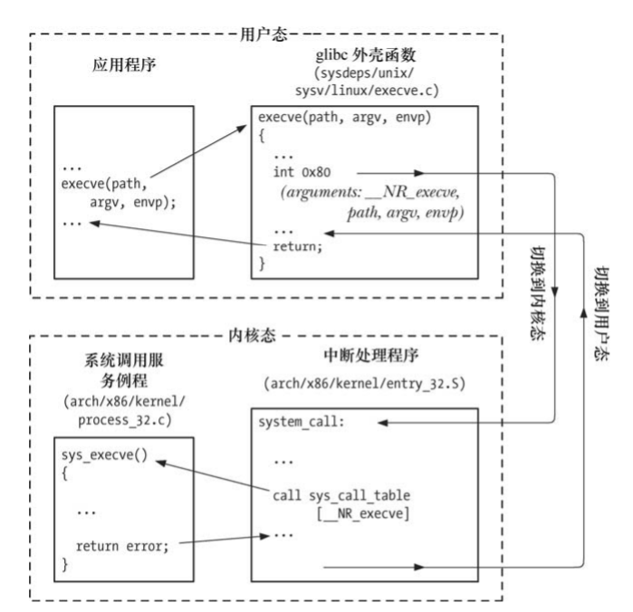
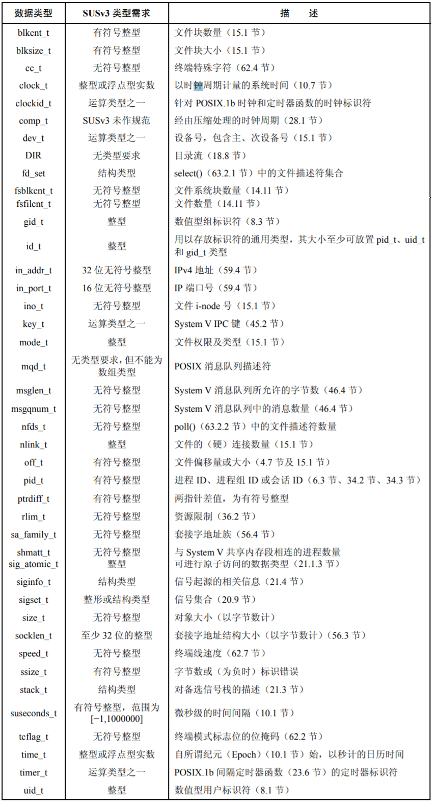

# 第03章 系统编程概念

## 3.1 系统调用

系统调用是受控的内核入口，通过这一机制，进程可以请求内核以自己的名义去执行某些动作。使用```man 2 syscalls```命令可查看Linux系统调用列表。

* 系统调用会把处理器冲用户态切换到内核态，以便CPU访问受保护的内核内存。
* 系统调用的组成是固定的，每个系统调用都由一个唯一的数字标识。
* 每个系统调用可辅以一套参数，用于用户空间和内核中间之间传递消息。

系统调用的过程：

1. 应用程序通过C语言函数库中的外壳函数（wrapper）发起系统调用。
2. 外壳函数会把函数参数复制到寄存器。
3. 外壳函数把系统调用编号复制到一个特殊的CPU寄存器（%eax）中。
4. 外壳函数执行中断机器指令（int 0x80），引发处理器冲用户态切换到内核态，并执行系统终端0x80的终端矢量所指向的代码。
5. 内核会调用```system_call()```例程来处理这次中断：
   * 内核栈中保留寄存器值。
   * 审核系统调用编号的有效性。
   * 检查参数有效性，调用相关系统调用。
   * 内核栈中恢复各寄存器值。
   * 返回至壳函数，同时处理器切换到用户态。
6. 如果系统调用返回值出错，外壳函数会设置全局变量errno。



## 3.2 库函数

对系统调用的二次封装，使系统调用更加易用，但有时候也会因为一些库函数的缓存机制带来麻烦，因此想要用好库函数需要了解他的原理。

## 3.3 标准C语言函数库；GNU C语言函数库（glibc）

标准C语言库是一种规范，其实现随UNIX的实现而异。GNU C语言函数库是Linux上最常用的标准C语言库的实现。通过```ldd /path/name```可以列出可执行文件依赖了哪些动态库，一般C程序都会包含glibc库。

## 3.4 处理系统调用和函数库的错误

### 3.4.1 系统调用错误处理

通常情况下，成功返回0，失败返回-1。man文档中有对错误的详细描述。错误发现会对全局变量errno设置一个值，```<errno.h>```中针对每一个错误码定义了常量。```perror()```函数可打印errno值对应的字符串，```strerror()```会返回errno值对应的字符串。

```C
cnt = read(fd, buf, numbytes);
if (cnt == -1) {
    if (errno == EINTR) {
        fprintf(stderr, "read was interrupted by a signal\n")
    } else {
        /* Some other error occurred */
        perror（"open"）；
    }
}
```

### 3.4.2 库函数错误处理

库函数返回值样式比较多，大致可分为如下三类：

* 成功返回0，失败返回-1，会设置errno值。
* 成功返回对象或者指针，失败返回NULL，会设置errno值。
* 函数本身就不会使用errno值，其成功失败的形态在手册中规定。

## 3.5 示例程序的注意事项

### 3.5.1 命令行选项及参数

* 单个字符选项：以‘-’开头
* 多个字符选项：以‘--’开头

可使用```getopt()```函数对命令行选项进行解析。

### 3.5.2 书中头文件

```C
# define min(m, n) ((m) < (n) ? (m) : (n))
# define max(m, n) ((m) > (n) ? (m) : (n))
# define NORETURN __attribute__ ((__noreturn__))	//告诉编译器，函数不会返回
abort();  //产生SIGABRT信号，会终止进程，并且产生核心转储文件
```

##  3.6 可移植性问题

```C
<sys/types.h>	//为了避免可以执行，此头文件中定义了大多数系统标准数据类型
//如：pid_t mypid; 系统pid字节数随着内核版本而定的，所以使用pid_t可以避免可移植性的问题。
```



