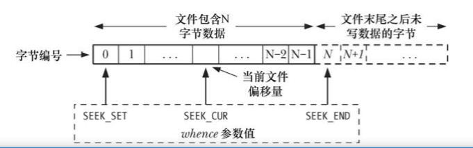

# 第04章 通用I/O模型

## 4.1 概述

* 文件描述符：以一个非负整数来指代一个打开的文件，所有I/O操作都是以文件描述符为基础，每个进程都有自己的一套文件描述符。

| 文件描述符 | 用途     | POSIX名称     | stdio流 |
| ---------- | -------- | ------------- | ------- |
| 0          | 标准输入 | STDIN_FILENO  | stdin   |
| 1          | 标准输出 | STDOUT_FILENO | stdout  |
| 2          | 标准错误 | STDERR_FILENO | stderr  |

## 4.2 通用I/O

UNIX I/O 模型的显著特点之一是其输入/输出的通用性。着使用 4 个同样的系统调用 open()、read()、write()和 close()可以对所有类型的文件执行 I/O 操作，包括终端之类的设备。

## 4.3 打开一个文件：open()

```C
# include <sys/stat.h>
# include <fcntl.h>
int open(const char *pathname, int flags, .../* mod_t mode */)
//man 2 open
```

### 4.3.1 flags常用标志位

| 标志        | 用途                                                   | 统一UNIX规范版本 |
| ----------- | ------------------------------------------------------ | ---------------- |
| O_RDONLY    | 以只读形式打开                                         | v3               |
| O_WRONLY    | 以只写方式打开                                         | v3               |
| O_RDWR      | 以读写方式打开                                         | v3               |
| O_CLOEXEC   | 设置close-on-exec标志                                  | v4               |
| O_CREAT     | 若文件不存在，则创建文件                               | v3               |
| O_DIRECT    | 无缓冲的输入/输出                                      |                  |
| O_DIRECTORY | 如果pathname不是目录，则失败                           | v4               |
| O_EXCL      | 结合O_CREAT参数使用，专门用于创建文件                  | v3               |
| O_LARGEFILE | 在32位系统中打开大文件                                 |                  |
| O_NOATIME   | 调用read()时，不修改文件最近访问时间（Linux2.6.8开始） |                  |
| O_NOCTTY    | 不要让pathname成为控制终端                             | v3               |
| O_NOFOLLOW  | 对符号链接不予解引用                                   | v4               |
| O_TRUNC     | 截断已有文件，使其长度为0                              | v3               |
| O_APPEND    | 在文件尾部追加数据                                     | v3               |
| O_ASYNC     | 当I/O操作可行时，产生信号通知进程                      |                  |
| O_DSYNC     | 提供同步的I/O数据完整性（自Linux2.6.33版本开始）       | v3               |
| O_NONBLOCK  | 以非阻塞方式打开                                       | v3               |
| O_SYNC      | 以同步方式写入文件                                     | v3               |

* O_ASYNC：信号驱动I/O，仅对特定类型文件有效（终端、管道、套接字），UNIX中可用，Linux中open()时设置此参数是无效的，必须调用fcntl()的F_SETFL操作的O_ASYNC标志。
* O_CLOEXEC：fork()后，子进程会继承父进程的fd，这很有可能产生一种越权行为，导致不可预料的后果。设置此标志后子进程不会继承父进程的fd。另外，open()之后通过fcntl()也可以设置此标志，但由于调用两个系统调用，多线程场景下可能会产生竞争条件。
* O_CREAT：如果文件不存在，将创建一个新的文件。
* O_DIRECT：读写操作会跳过OS缓存，因为没有OS缓存了，所以此标志会降低顺序读写的效率。
* O_DIRECTORY：如果pathname参数不是目录，则返回错误，使用此标志必须定义```_GNU_SOURCE```功能测试宏。
* O_DSYNC：每次write()都等待写入硬盘操作完成，可以不等待文件属性更新。
* O_SYNC：每次write()都等待写入硬盘操作完成，必须等待文件属性更新的完成。
* O_RSYNC：每次read()时，都等待OS缓存都flush到硬盘了。
* O_EXCL：与O_CREAT联合使用，如果文件已存在，则不会打开文件，返回错误EEXIST。
* O_NOATIME：读文件时，不更新最近访问时间。使用这个标志时，需要进程有效用户和文件所有者相匹配，或者进程拥有特权。
* O_NOFOLLOW：使用这个标志，打开一个符号链接时，open()函数将返回失败（错误号 errno 为 ELOOP）。

### 4.3.2 open()常用错误码

* EACCES：文件权限不允许以flags参数指定的方式打开文件。
* EISDIR：要打开的文件是一个目录，通常情况下不允许对目录进行写操作。
* ENFILE：文件打开数量已经达到系统允许的上限。
* ENOENT：文件不存在，并且未指定O_CREAT标志。
* EROFS：文件是只读的，调用者企图用写的方式打开。
* ETXTBSY：要打开的文件是正在运行的程序文件。系统不允许修改正在运行的程序。

### 4.3.3 create()系统调用

```C
# include <fcntl.h>
int creat(const char *pathname, mode_t mode);
//等价于 fd = open(pathname, O_WRONLY | o_CREAT | O_TRUNC, mode);
```

根据pathname和参数创建并打开一个文件，如果文件已存在，则文件长度清0。creat()函数已过时，不推荐使用。

### 4.3.4 mode_t详解

```
S_IRWXU  00700 属主读、写、执行
S_IRUSR  00400 属主读
S_IWUSR  00200 属主写
S_IXUSR  00100 属主执行
S_IRWXG  00070 属组读、写、执行
S_IRGRP  00040 属组读
S_IWGRP  00020 属组写
S_IXGRP  00010 属组执行
S_IRWXO  00007 其他读、写、执行
S_IROTH  00004 其他读
S_IWOTH  00002 其他写
S_IXOTH  00001 其他执行
S_ISUID  0004000 把进程的有效用户设置为文件的所有者
S_ISGID  0002000 把进程的有效组设置为文件的组
S_ISVTX  0001000 粘着位，作用1：可执行程序执行结束后，会缓存到交换空间，由于交换空间的磁盘是连续的，不需要找block，所以可以实现快速加载程序的效果。作用2：用来标记目录，标记后的目录只有属主可以对其有写权限，其他人只能读。参考/tmp目录，所有人可读，属主可写。
```
## 4.4 读取文件内容：read()

```C
# include <unistd.h>
ssize_t read(int fd, void *buffer, size_t count);
//buffer是缓存的地址，count是一次最多能读取的字节数。
//成功返回实际读取的字节数，如果遇到文件结束符（EOF）返回0。
//失败返回-1并设置errno。
```

## 4.5 数据写入文件：write()

```C
# include <unistd.h>
ssize_t write(int fd, void *buffer, size_t count);
//buffer是缓存的地址，count是要写入的字节数。
//成功返回实际写入的字节数，可能会出现部分写的情况（磁盘已满或者进程资源对文件大小有限制）。
//失败返回-1，并设置错误码。
```

## 4.6 关闭文件：close()

```C
# include <unistd.h>
int close(int fd);
//成功返回0，失败返回-1并设置错误码。
```

## 4.7 改变文件偏移量：lseek()

```C
# include <unistd.h>
off_t lseek(int fd, off_t offset, int whence);
//成功返回偏移量，失败返回-1并设置错误码。
```

### 4.7.1 off_t详解

| 宏       | 值   | 含义                                   |
| -------- | ---- | -------------------------------------- |
| SEEK_SET | 0    | 相对于文件头部开始的offset个字节       |
| SEEK_CUR | 1    | 相对于当前文件偏移量起始的offset个字节 |
| SEEK_END | 2    | 相对于文件尾部起始的offset个字节       |



```C
lseek(fd, 0, SEEK_SET)		//文件头
lseek(fd, 0, SEEK_END)		//文件尾
lseek(fd, -1, SEEK_END)		//文件尾的前1个字节
lseek(fd, -10, SEEK_CUR)	//文件当前偏移的前10个字节
lseek(fd, 10000, SEEK_END)	//文件尾的后10000个字节
```

### 4.7.2 文件空洞

文件偏移量跨越了文件结尾，如```lseek(fd, 1000, SEEK_END)```，之后再进行I/O操作，read()调用会返回0，write()调用会写入数据，文件结尾到新写入数据之间的这段空间被称为文件空洞。文件空洞不占用任何磁盘空间（大多数情况下），当向文件空洞写入数据时，系统才会为其分配空间。

### 4.7.3 文件空间的实际分配和释放

```
# define _GNU_SOURCE
# include <fcntl.h>
int fallocte(int fd, int mode, off_t offset, off_t len);
```

* mode为0，表示给文件分配从offset开始到offset+len结束大小的实际空间。
* mode为```FALLOC_FL_PUNCH_HOLE | FALLOC_FL_KEEP_SIZE```，表示从文件中释放从offert开始到offset+len结束的实际空间，释放后的这部分会变成文件空洞。

## 4.8 通用I/O模型以外的操作：ioctl()

```C
# include <sys/ioctl.h>
int ioctl(int fd, int request, .../* argp */)
```

ioctl()主要是针对执行文件和设备操作提供的一个多用途接口，由于历史原因，ioctl()可能会存在一些移植性问题。


