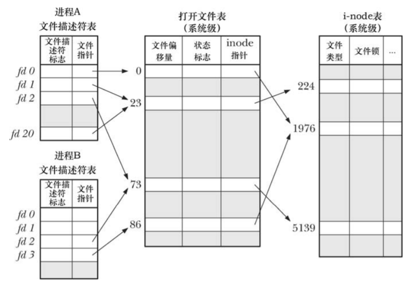
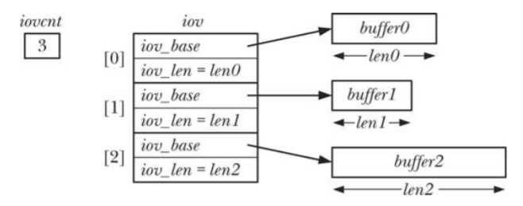

# 第05章 深入探究文件I/O

## 5.1 原子操作和竞争条件

* 竞争条件：当两个进程同时对同一个资源进行修改操作时，会产生竞争条件。
* 原子操作：内核保证了某些系统调用会一次性执行，不会被其他进程或线程所中断，原子操作的作用是为了避免竞争条件。

一段错误的代码说明竞争条件：

```C
//创建一个文件
fd = open(argv[1], O_WRONLY);	//打开文件
if (fd != 1) {		//如果文件存在，则关闭文件
    close(fd);	
} else {
    if (errno != ENOENT) {		//如果错误码不是“文件不存在”，则报错
        errExit("open");
    } else {		//创建文件
        fd = open(argv[1], O_WRONLY | O_CREAT, S_IRUSR | S_IWUSR);
        if (fd == -1) {
            errExit("open");
        }
    }
}
```

当多进程同时执行这段代码时，有概率出现如下场景：


## 5.2 文件控制操作：fcntl()

```
# include <fcntl.h>
int fcntl(int fd, int cmd, ...);
```

## 5.3 打开文件的状态标志

针对一个打开的文件，获取或修改访问模式和状态标志。

```
flags = fcntl(fd, F_GETFL);			//获取标记
if (flags == -1) {
    errExit("fcntl");
}
if (flags | O_SYNC) {				//判断是否有O_SYNC选项
    printf("sync");
}
accessmode = flags & O_ACCMODE;		//判断mode
if (accessmode == O_RDWR) {
    printf("rdwr");
}
flags |= O_APPEND;				    //设置O_APPEND选项
if (fcntl(fd, F_SETFL, flags) == -1) {
    errExit("fcntl")
}
```

## 5.4 文件描述符和打开文件之间的关系



## 5.5 复制文件描述符

原理：使oldfd、newfd同时指向一个打开文件句柄。

```C
# include <unistd.h>
int dup(int oldfd);  //成功返回newfd，系统自动分配可用编号最小的，失败返回-1。
int dup2(int oldfd, int newfd);  //指定newfd的编号，成功返回0，失败返回-1。
int dup3(int oldfd, int newfd, int flags); //比dup2多出来一个flags参数，目前只支持O_CLOEXEC选项。
//dup3使Linux特有的，从Kernel-2.6.27开始支持
```

## 5.6 在文件特定偏移量处的I/O：pread()和pwrite()

```C
# include <unistd.h>
ssize_t pread(int fd, void *buf, size_t count, off_t offset);
ssize_t pwrite(int fd, const void *buf, size_t count, off_t offset);
```

作用：把lseek()和read()|write()封装成一个原子操作，避免竞争条件。

## 5.7 分散输入和集中输出：readv()和writev()

```C
# include <sys/uio.h>
ssize_t readv(int fd, const struct iovec *iov, int iovcnt);
ssize_t writev(int fd, const struct iovec *iov, int iovcnt);
ssize_t preadv(int fd, const struct iovec *iov, int iovcnt, off_t offset);
ssize_t pwritev(int fd, const struct iovec *iov, int iovcnt, off_t offset);

struct iovec {
    void *iov_base;		//指向buffer的指针
    size_t iov_len;		//buffer的长度
};

//iov是个struct iovec数组，iovcnt是数组长度，offset是偏移量
//从Kernel 2.6.30开始，Linux支持preadv()和pwritev()
```



分散输入、集中输出的意义在于，可以减少上下文切换的次数，从而提高性能，另外readv()和writev()本身是原子的。

## 5.8 截断文件：truncate()和ftruncate()系统调用

```C
# include <unistd.h>
int truncate(const char *pathname, off_t length);	//通过文件名截断
int ftruncate(int fd, off_t length);			//通过fd截断
```

若文件当前长度大于length，则将丢弃超出部分。

## 5.9 非阻塞I/O

在打开文件时，指定O_NONBLOCK标志，目的有二：

* open()调用未能立即打开文件，则返回错误，而非阻塞等待。
* open()成功后，后续的I/O操作也是非阻塞的。若I/O系统调用未能立即完成，则可能只会传输部分数据或系统调用失败，并返回EAGAIN或EWOULDBLOCK错误。

## 5.10 大文件I/O

32位体系架构中，文件大小被限制在2GB，而磁盘的容量远超于这个限制，所以在Kernel 2.2版本出了个针对大文件的补丁。在open()时指定O_LARGEFILE标志，可以打开大文件。与此对应的函数是open64()，可以忽略O_LARGEFILE标志。（已过时，目前基本都是64位体系架构的了）

## 5.11 /dev/fd目录

对于每个进程，内核都提供有一个特殊的虚拟目录/dev/fd。该目录中包含“/dev/fd/n”形式的文件名，其中 n 是与进程中的打开文件描述符相对应的编号，/dev/fd/n实际上是一个符号链接，链接到/proc/self/fd/n。

```C
fd = open("/dev/fd/1", O_WRONLY);
fd = dup(1);
//以上两条语句是等价的，都表示复制文件描述符1。
```

## 5.12 创建临时文件

```C
# include <stdlib.h>
int mkstemp(char *template);
//template后6位必须位XXXXXX，mkstemp执行完成后会重新对template后6位赋值。
//临时文件使用完成后，应该调用unlink(template)删除临时文件。
//返回一个文件描述符

# include <stdio.h>
FILE *tmpfile(void);
//打开文件后，返回一个FILE*指针，当关闭文件或者结束程序时，会自动删除该文件。
```

实现原理：创建好临时文件后，会立即调用unlink()删除该文件的原始硬链接。当fd关闭后，临时文件i-node的引用计数减为0，系统会自动删除临时文件。


