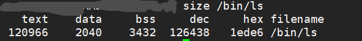
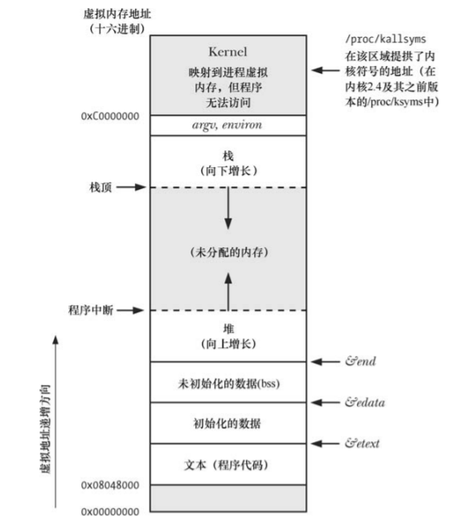
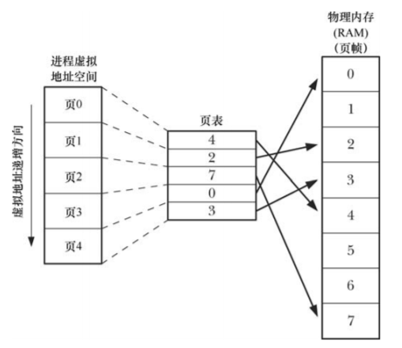
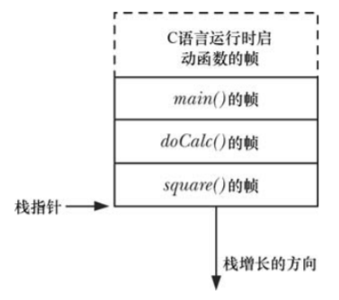
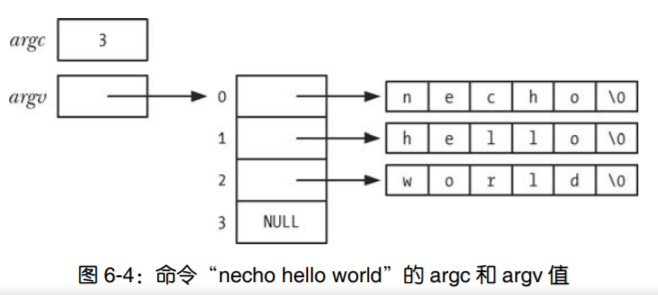
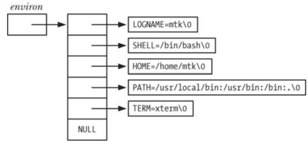

# 第06章 进程

## 6.1 进程和程序

程序是一个磁盘上的文件，进程是一组内核数据结构，进程是程序的实例。

一个进程会包括如下信息：

* 二进制格式标识：由于历史原因，二进制文件也分为多种格式，如a.out、COFF、ELF，现在Linux主要使用ELF。
* 机器语言指令：二进制程序，CPU可执行。
* 程序入口点：标识程序开始执行的位置。
* 数据：字面值常量、初始化的变量。
* 符号表和重定位表：描述程序中函数和变量的位置及名称。
* 共享库和动态链接信息：程序运行时使用的共享库，以及加载共享库的动态链接器的路径。
* 等

## 6.2 进程号和父进程号

```C
# include <unistd.h>
pid_t getpid(void);		//获取进程号
pid_t getppid(void);	//获取父进程号
```

## 6.3 进程的内存布局

* 文本段：包含了进程运行的机器语言指令程序，只读。
* 初始化段：包含显式初始化的全局变量和静态变量。
* 未初始化段（BSS段）：未显式初始化的全局变量和静态变量，系统会把此段初始化为0。
* 栈：一个自动增长和收缩的段，用于函数调用。
* 堆：一块内存，用于运行时动态分配内存。





## 6.4 虚拟内存管理

Linux内核采用虚拟内存机制，使每个进程看到的都是一个连续的内存空间，6.3中进程的内存布局就是基于连续内存的。



进程中，有可能会开辟或释放内存页的操作如下：

* 栈向下增长超出曾经达到的位置。
* 分配堆内存：brk()、sbrk()、malloc()等。
* SystemV共享内存区域：shmat()、shmdt()。
* 内存映射：mmap()、munmap()。

虚拟内存的优点：

* 进程与进程、进程与内核相互隔离，进程不能读取或修改另一个进程或内核的内存。
* 适当的情况下，多个进程能够共享内存，如父子进程共享文本段、SystemV共享内存、内存映射。
* 便于实现内存保护模式。
* 程序员和编译器、链接器之类的工具无需关注RAM中物理布局。
* 因为需要驻留在内存中的仅是程序的一部分，所以程序的加载和运行都很快。

## 6.5 栈和栈帧



每个栈帧包含如下信息：

* 函数实参和局部变量
* 函数调用的链接信息（寄存器信息）

## 6.6 命令行参数

每个C程序都有一个main()入口点，shell启动C程序时，会提供给main()两个参数：argc、argv。

```
int main(int argc, char *argv[]) {}
```




命令行参数可以理解为向程序传入配置选项的一种手段。除命令行参数之外，通过配置文件、环境变量也可以实现类似的功能。在远古时代，命令行参数作为一种标准的配置传入手段，不过近几年随着docker的流行，很多程序采用环境变量的形式传入参数。

## 6.7 环境列表

通过```export XXXX=xxxx```可以设置bash的环境变量，bash启动程序时，会把当前环境变量传入程序的环境变量列表。

```
# include <stdio.h>
extern char **environ;  //环境变量列表
int main() {
    char **var;
    for (var=environ; *var!=NULL; var++) {
        printf("%s\n", *var);
    }
    return 0;
}
```



```C
# include <stdlib.h>
char *getenv(cost char *name); //获取单个环境变量，成功返回字符串，失败返回NULL。
int putenv(char *string); //向调用进程的环境中添加一个新变量
int setenv(const char *name, const char *value, int overwrite);//overwrite为0则不改变环境变量，非0改变
int unsetenv(const char *name);  //删除一个环境变量
//setenv()和unsetenv()是glibc实现的非标准扩展，后来被SUSv3采纳
int clearenv(void)	//清空全部环境变量
```

## 6.8 非局部跳转：setjmp()和longjmp()

类似于C中的goto，C中goto解决的是跳出多重for循环。setjmp()和longjmp()解决的是跳出多重函数递归执行。

```C
# include <setjmp.h>
int setjmp(jmp_buf env);       //设置位置
void longjmp(jmp_buf env, int val);      //跳到位置
```

和goto同理，尽量避免使用setjmp()和longjmp()，编译器优化后，可能会产生不可预料的结果。

```C
#include <stdio.h>
#include <setjmp.h>

static jmp_buf buf;

void second(void) {
    printf("second\n");         // 打印
    longjmp(buf,1);             // 跳回setjmp的调用处 - 使得setjmp返回值为1
}

void first(void) {
    second();
    printf("first\n");          // 不可能执行到此行
}

int main() {   
    if ( ! setjmp(buf) ) {
        first();                // 进入此行前，setjmp返回0
    } else {                    // 当longjmp跳转回，setjmp返回1，因此进入此行
        printf("main\n");       // 打印
    }
    return 0;
}
```


