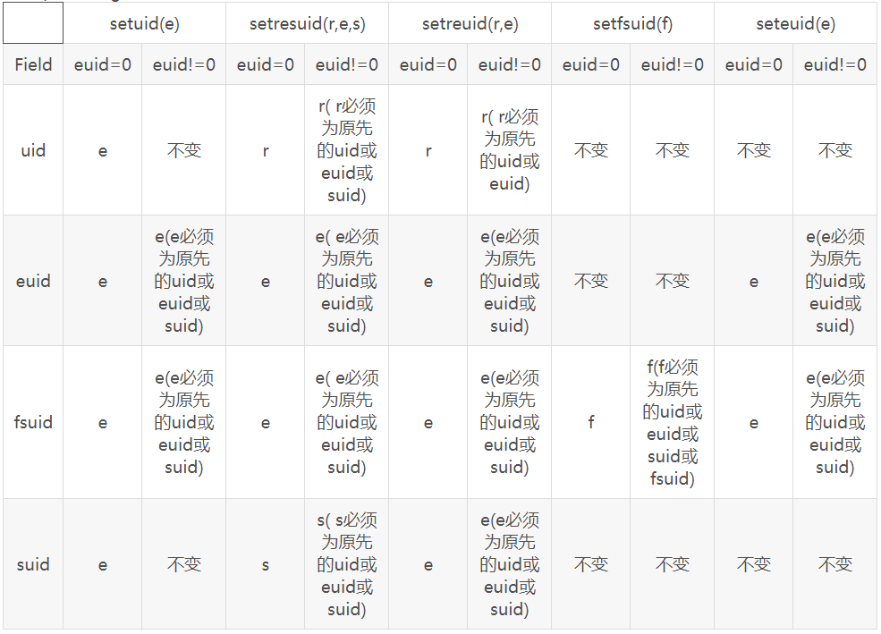

# 第09章 进程凭证

## 9.1 实际用户ID和实际组ID

real user ID(ruid) & real group ID(rgid)，进程的执行者是谁。

## 9.2 有效用户ID和有效组ID

effective user ID(euid) & effective group ID(egid)，进程执行时对文件的访问权限。

## 9.3 保留用户ID和保留组ID

saved set-user-ID(suid) & saved set-group-ID(sgid)，euid和egid的副本，用于进程凭证恢复。

## 9.4 Set-User-ID(SUID)和Set-Group-ID(SGID)标记

SUID标记会把进程的euid设置为其源程序的属主，SGID标记会把进程的egid设置为其源程序的属组。SUID的优先级高于SGID，当源程序设置了SUID，则其进程的egid会被设置为其源程序的属组。

```shell
#修改文件权限
chmod u+s /bin/ls
chmod g+s /bin/ls

#权限位详解
b a 9 8 7 6 5 4 3 2 1 0
S G T r w x r w x r w x
[2-0]rwx	:	其他读、写、可执行
[5-3]rwx	:	属组读、写、可执行
[8-7]rwx	:	属主读、写、可执行
[9]T		:	粘着位
[a]G		:	SGID位
[b]S		:	SUID位

-rwsr-xr-x	:	s表示设置了可执行位和SUID位
-rwSr--r--	:	S表示没设置可执行位，但设置了SUID
-rwxr-sr-x	:	s表示设置了可执行位和SGID位
-rw-r-Sr--	:	S表示没设置可执行位，但设置了SGID
-rwxr-xr-t	:	t表示设置了可执行位和粘着位
-rwxr-xr-T	:	T表示没设置可执行位，但设置了粘着位
```

## 9.5 文件系统用户ID和文件系统组ID

file-system-user-ID(fsuid) & file-system-group-ID(fsgid)

注意：此为Linux独有的特性，Kernel2.0之后，由于信号发送权限机制改动(SUSv3强制规定)，现阶段已无实际作用，只是为了保持兼容。

在 Linux 系统中对文件系统操作时（打开文件、改变文件属主、修改文件权限等），决定其操作权限的是fsuid和fsgid（结合辅助组ID），而非euid 和egid。通常，fsuid、fsgid与euid、egid相等，只要euid、egid发生改变fsuid、fsgid也会随之改变。只有当使用 Linux 特有的两个系统调用（setfsuid()和 setfsgid()）时，才可以刻意制造出fsuid、fsgid与euid、egid不等的情况。

文件系统 ID 始见于 Linux 1.2 版本。在该版本的内核中，如果进程某甲的有效用户 ID 等同于进程某乙的实际用户 ID 或者有效用户 ID，那么发送者（某甲）就可以向目标进程（某乙）发送信号。比如 Linux NFS（网络文件系统）服务器程序，在访问文件时就好像拥有着相应客户进程的有效 ID。然而，如果 NFS 服务器真地修改了自身的有效用户 ID，面对非特权用户进程的信号攻击，又将不堪一击。为了防范这一风险，文件系统用户 ID 和组 ID 应运而生。

## 9.6 辅助组ID

辅助组 ID 用于标识进程所属的若干附加的组。新进程从其父进程处继承这些 ID，登录shell 从系统组文件中获取其辅助的组 ID。如前所述，将这些 ID 与有效 ID 以及文件系统 ID相结合，就能决定对文件、System V IPC 对象和其他系统资源的访问权限。

## 9.7 获取和修改进程凭证

可以通过```/proc/PID/status```来获取和修改进程凭证（不推荐使用，仅供参考），内容如下：

```ini
Name:	migration/1
State:	S (sleeping)
Tgid:	12
Ngid:	0
Pid:	12
PPid:	2
TracerPid:	0
Uid:	0	0	0	0
Gid:	0	0	0	0
FDSize:	64
Groups:	
NStgid:	12
NSpid:	12
NSpgid:	0
NSsid:	0
Threads:	1
SigQ:	0/15651
SigPnd:	0000000000000000
ShdPnd:	0000000000000000
SigBlk:	0000000000000000
SigIgn:	ffffffffffffffff
SigCgt:	0000000000000000
CapInh:	0000000000000000
CapPrm:	0000003fffffffff
CapEff:	0000003fffffffff
CapBnd:	0000003fffffffff
CapAmb:	0000000000000000
Seccomp:	0
Cpus_allowed:	2
Cpus_allowed_list:	1
Mems_allowed:	00000000,00000001
Mems_allowed_list:	0
voluntary_ctxt_switches:	43659
nonvoluntary_ctxt_switches:	0
```




```C
#include <unistd.h>
uid_t getuid(void);		//获取实际用户
uid_t geteuid(void);	//获取有效用户
gid_t getgid(void);		//获取实际组
gid_t getegid(void);	//获取有效组

int setuid(uid_t uid);	//设置euid(特权进程会设置ruid、suid)
int setgid(gid_t gid);	//设置egid（特权进程会设置rgid、sgid）

int seteuid(uid_t uid);	//设置euid（仅设置euid）
int setegid(gid_t gid);	//设置egid（仅设置egid）

int setreuid(uid_t ruid, uid_t euid);	//设置ruid和euid，不设置可写-1
int setregid(gid_t rgid, gid_t egid);	//设置rgid和egid，不设置可写-1

int getgroups(int gidsetsize, gid_t grouplist[]);	//获取辅助组ID

# define _BSD_SOURCE
# include <grp.h>
int setgroups(size_t gidsetsize, const gid_t *grouplist);	//设置进程辅助组，euid==0可以使用
int initgroups(const char *user, gid_t group);	//会扫描/etc/groups文件，为进程初始化辅助组

# define _GNU_SOURCE
# include <unistd.h>
int getresuid(uid_t *ruid, uid_t *euid, uid_t *suid);	//获取ruid、euid和suid
int getresgid(gid_t *rgid, gid_t *egid, gid_t *sgid);	//获取rgid、egid和sgid
int setresuid(uid_t ruid, uid_t euid, uid_t suid);	//设置ruid、euid和suid，不设置可写-1
int setresgid(gid_t rgid, gid_t egid, gid_t sgid);	//设置rgid、egid和sgid，不设置可写-1

# include <sys/fsuid.h>
int setfsuid(uid_t fsuid);	//设置fsuid
int setfsgid(gid_t fsgid);	//设置fsgid
```


