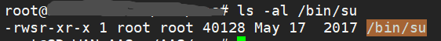
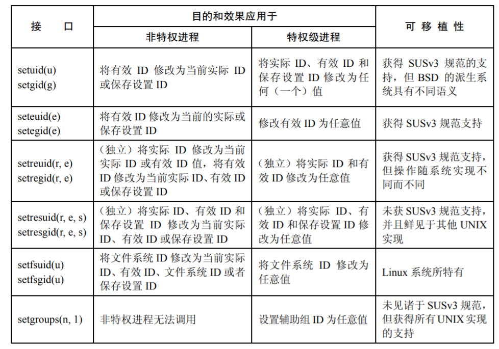

# 第09章 进程凭证

每个进程都有一套用数字表示的UID和GID作为进程凭证。

## 9.1 实际用户ID和实际组ID

这两个ID确定了进程所属的用户和组，进程的用户ID和组ID与登录用户的ID和组ID相同。

## 9.2 有效用户ID和有效组ID

有效ID用来决定进程的访问权限，持有有效ID的进程，有权限访问有效ID标记的系统资源。如：有效用户ID为0的进程访问一个属主为0的文件。一般情况下有效用户ID等于实际用户ID，有效组ID等于实际组ID。

## 9.3 保留用户ID(Saved set-user-ID)和保留组ID(Saved set-group-ID)

进程保留ID是进程有效ID的一份副本。当进程有效ID发生改变时，进程保留ID还会有一份副本，以便于找回原配置。

## 9.4 Set-User-ID和Set-Group-ID标记

文件可执行权限的修饰符，只有可执行权限才可以使用Set-User-ID、Set-Group-ID标记修饰。Set-User-ID标记会把进程的有效用户设置为其源程序的属主，Set-Group-ID标记会把进程的有效组设置为其源程序的数组。



```shell
chmod u+s /bin/ls
chmod u-s /bin/ls
chmod g+s /bin/ls
chmod g-s /bin/ls
```

## 9.5 文件系统的用户ID和组ID

在 Linux 系统中，要进行诸如打开文件、改变文件属主、修改文件权限之类的文件系统操作时，决定其操作权限的是文件系统用户 ID 和组 ID（结合辅助组 ID），而非有效用户 ID 和组ID。

文件系统用户 ID 和组 ID 的值等同于相应的有效用户 ID 和组 ID，只有当使用 Linux 特有的两个系统调用（setfsuid()和 setfsgid()）时，才可以刻意制造出文件系统 ID 与相应有效 ID 的不同。

文件系统的用户ID和组ID的出现主要是因为历史原因，现阶段已无实际作用，只是为了保持兼容。

## 9.6 辅助组ID

用于表示进程所属的附加组，新进程也会继承父进程的辅助组。

## 9.7 获取和修改进程凭证

可以通过```/proc/PID/status```来获取和修改进程凭证（不推荐使用，仅供参考），内容如下：

```ini
Name:	migration/1
State:	S (sleeping)
Tgid:	12
Ngid:	0
Pid:	12
PPid:	2
TracerPid:	0
Uid:	0	0	0	0
Gid:	0	0	0	0
FDSize:	64
Groups:	
NStgid:	12
NSpid:	12
NSpgid:	0
NSsid:	0
Threads:	1
SigQ:	0/15651
SigPnd:	0000000000000000
ShdPnd:	0000000000000000
SigBlk:	0000000000000000
SigIgn:	ffffffffffffffff
SigCgt:	0000000000000000
CapInh:	0000000000000000
CapPrm:	0000003fffffffff
CapEff:	0000003fffffffff
CapBnd:	0000003fffffffff
CapAmb:	0000000000000000
Seccomp:	0
Cpus_allowed:	2
Cpus_allowed_list:	1
Mems_allowed:	00000000,00000001
Mems_allowed_list:	0
voluntary_ctxt_switches:	43659
nonvoluntary_ctxt_switches:	0
```



