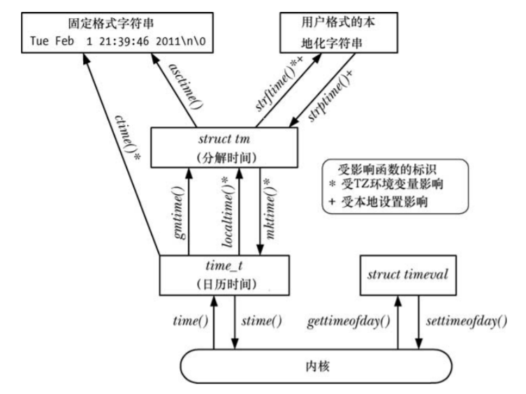
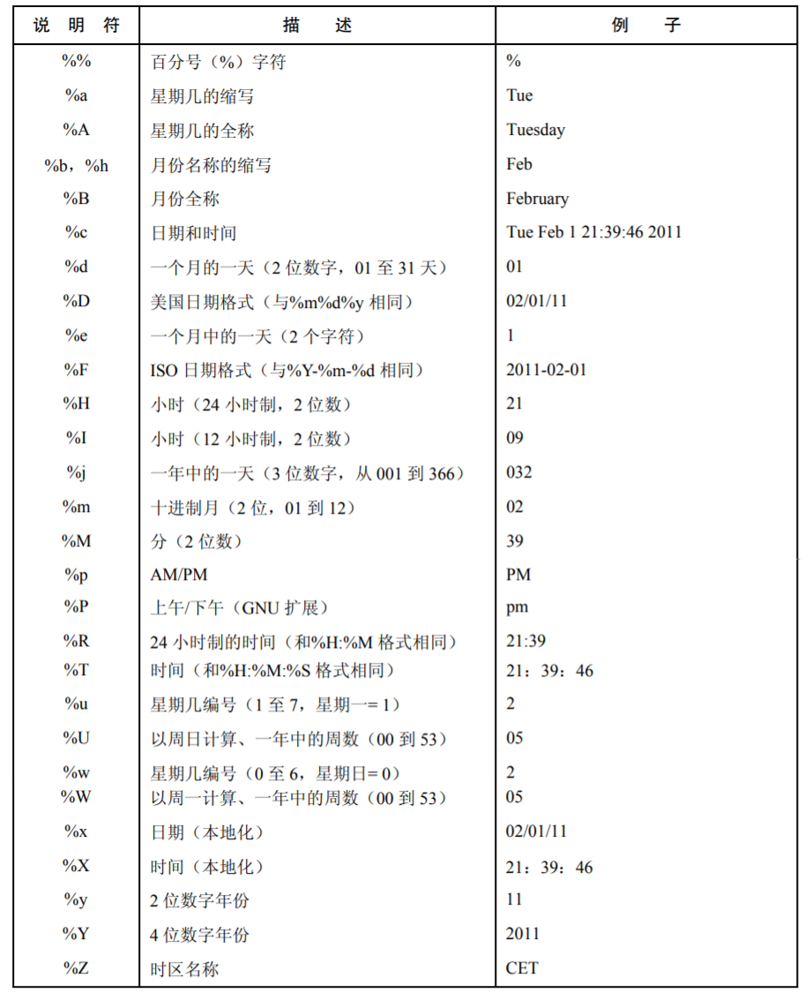

# 第10章 时间

## 10.1 日历时间（Calendar Time）

```C
# include <sys/time.h>
int gettimeofday(struct timeval *tv, struct timezone *tz);
struct timeval {	//时间结构
    time_t tv_sec;	//1970-1-1 0:0:0到现在的秒数（int）
    suseconds_t tv_usec;   //附加的微秒（long），1ms == 0.000 001s
};
struct timezone {	//已经废弃，直接写NULL
    int tz_minuteswest;	//格林威治时间往西方的时差
    int tz_dsttime;		//DST 时间的修正方式
};

# include <time.h>
//返回1970-1-1 0:0:0到现在的秒数，相当于struct timeval结构中的tv_sec参数.
//有两种返回形式，返回值和timep指针，通常使用返回值：timep = time(NULL);
time_t time(time_t *timep);	
```

## 10.2 时间转换函数



### 10.2.1 将time_t转换为RFC-2822兼容日期格式字符串

```C
# include <time.h>
char *ctime(const time_t *timep);	//返回RFC-2822兼容日期格式字符串
```

### 10.2.2 time_t的合成和分解

```C
# include <time.h>
struct tm *gmtime(const time_t *timep);		//分解时间，不考虑时区
struct tm *localtime(const time_t *timep);	//分解时间，会计算时区的偏移量
struct tm *gmtime_r(const time_t *timep, struct tm *result);	//可重入模式的gmtime()
struct tm *localtime_r(const time_t *timep, struct tm *result);	//可重入模式的localtime()
time_t mktime(struct tm *timeptr);		    //合成时间

struct tm {
    int tm_sec;		//秒（0-60）
    int tm_min;		//分（0-59)
    int tm_hour;	//时（0-23)
    int tm_mday;	//日（1-31）
    int tm_mon;		//月 (0-11）
    int tm_year;	//年（1900-）
    int tm_wday;	//星期几（星期日为0）
    int tm_yday;	//一年中的第几天（0-365；1月1日为0）
    int tm_isdst;	//时区偏移量
};
```

### 10.2.3 分解时间转字符串

```C
# include <time.h>
char *asctime(const struct tm *timeptr);	//返回RFC-2822兼容日期格式字符串
char *asctime_r(const struct tm *tm, char *buf);	//asctime的可重入版本

//分解时间转字符串
size_t strftime(char *outstr, size_t maxsize, const char *format, const struct tm *timeptr); 

# define _XOPEN_SOURCE
# include <time.h>
//字符串转分解时间
char *strptime(const char *str, const char *format, struct tm *timeptr);
```



## 10.3 时区

略：心里没数，等用到了再看把。。

## 10.4 地区

略：心里没数，等用到了再看把。。

## 10.5 更新系统时钟

很少会用到这个接口，一般由网络时间协议守护进程维护。

```c
# define _BSD_SOURCE
# include <sys/time.h>
//timeval是分解时间结构，timezone是时区（写NULL）
int settimeofday(const struct timeval *tv, const struct timezone *tz);

//修改系统时间，精确到微妙
int adjtime(struct timeval *delta, struct timeval *olddelta);
```

## 10.6 软件时钟（jiffies）

时间相关的各种系统调用的精度是受限于系统软件时钟（software clock)的分辨率，它的度量单位被称为 jiffies。jiffies 的大小是定义在内核源代码的常量 HZ。这是内核按照 round-robin 的分时调度算法（35.1 节）分配 CPU 进程的单位。

## 10.7 进程时间

进程时间是进程创建后使用的 CPU 时间数量。内核把 CPU 时间分成以下两部分：

* 用户 CPU 时间是在用户模式下执行所花费的时间数量。（用户态时间）
* 系统 CPU 时间是在内核模式中执行所花费的时间数量。（内核态时间）

```C
# include <sys/times.h>
clock_t times(struct tms *buf);
struct tms {
    clock_t tms_utime;	//用户态时间
    clock_t tms_stime;	//内核态时间
    clock_t tms_cutime;	//用户态时间（包含子进程）
    clock_t tms_sctime;	//内核态时间（包含子进程）
};

#include <time.h>
//返回当前进程使用CPU的时间（用户态时间+内核态时间）。
//单位是1/CLOCKS_PER_SEC秒，POSIX.1规定CLOCKS_PER_SEC是10000，定义在time.h中。
clock_t clock(void);
```
