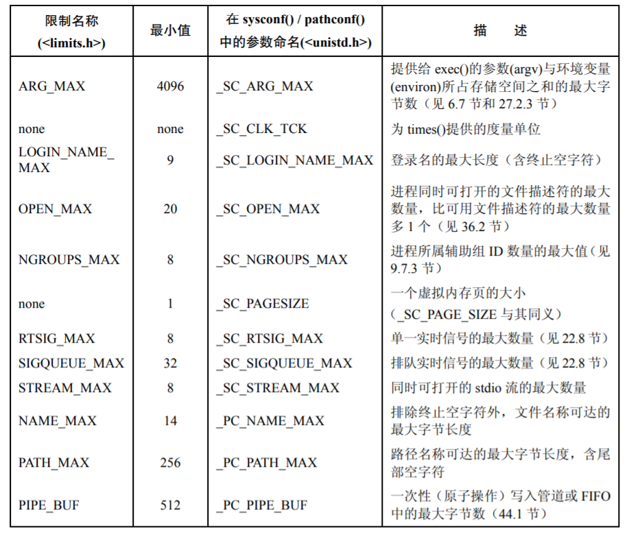
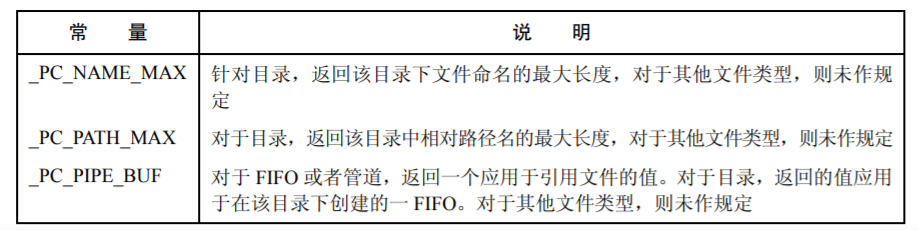
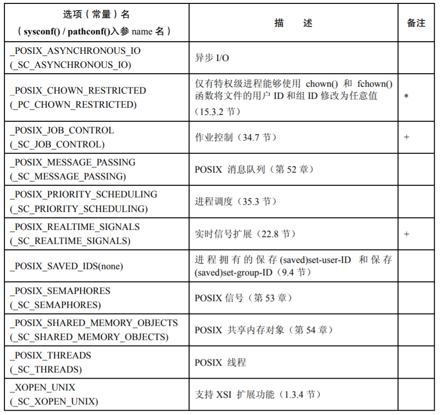

# 第11章 系统限制和选项

## 11.1 系统限制

* 最小值

  SUSv3要求，针对其所规范的每个限制，所有实现都必须支持一个最小值。这些限制条件被定义为```<limits.h>```中的常量，通常格式为```_POSIX_XXX_MAX```（MAX表示的是资源上限的最小值，MIN表示资源下限的最大值）。

* 运行时恒定值

  在```limits.h```中定义，运行时恒定不变，但可能会随着系统、硬件的改变而改变。

* 路径名变量值

  随着文件系统的不同而不同。

* 运行时可增加值

  所有系统都应该支持最小值，特定系统在运行时可能会增加该值。



## 11.2 在运行时获取系统限制

```C
# include <unistd.h>
long sysconf(int name);
```

## 11.3 在运行时获取文件相关的限制

```C
#include <unistd.h>
long pathconf(const char *pathname, int name);	//通过path获取
long fpathconf(int fd, int name);			   //通过fd获取
```



## 11.4 不确定的限制

调用```sysconf()```或```pathconf()```获取限制，如果限制不确定，则函数会返回一个合理的估值。

## 11.5 系统选项

系统选项的级别：

* -1：不支持。
* 0：有可能支持，需要程序验证。
* 大于1：支持。



## 