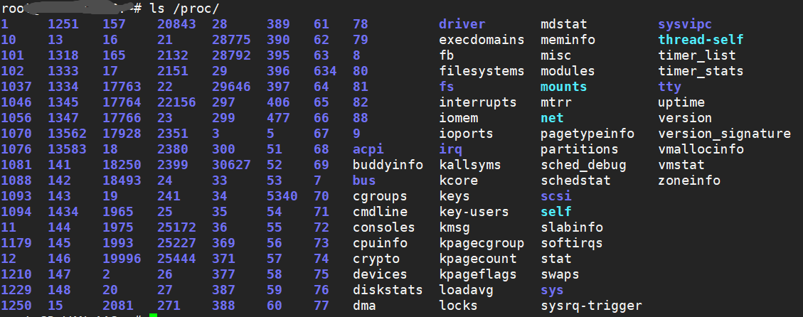

# 第12章 系统和进程信息

## 12.1 /proc文件系统

正在运行的内核属性，以文件系统的形式存放在```/proc```目录中，可以通过```/proc```目录来查看或修改内核属性。



### 12.1.1 获取进程有关的信息：/proc/PID

每个进程，在```/proc```文件系统中是一个以其PID命名的目录，其主要内容如下：


### 12.1.2 /proc目录下的系统信息


### 12.1.3 操作/proc文件

方法很多，可以用通用I/O模型来操作，也可以用shell来操作，vim来操作，就和读写普通文件一样。

```shell
#例：开启混杂模式
echo 1 > /proc/sys/net/ipv4/ip_forward
```

## 12.2 系统标识：uname()

```C
# include <sys/utsname.h>
int uname(struct utsname *utsbuf);

#define _UTSNAME_LENGTH 65
struct utsname {
    char sysname[_UTSNAME_LENGTH];	//系统名称（Linux），内核自动设置
    char nodename[_UTSNAME_LENGTH];	//主机名称，由sethostname()设置
    char release[_UTSNAME_LENGTH];	//内核版本，内核自动设置
    char version[_UTSNAME_LENGTH];	//发布时间，内核自动设置
    char machine[_UTSNAME_LENGTH];	//硬件架构（i686），内核自动设置
#ifdef _GNU_SOURCE
    char domainname[_UTSNAME_LENGTH];	//域名
#endif
};
```

