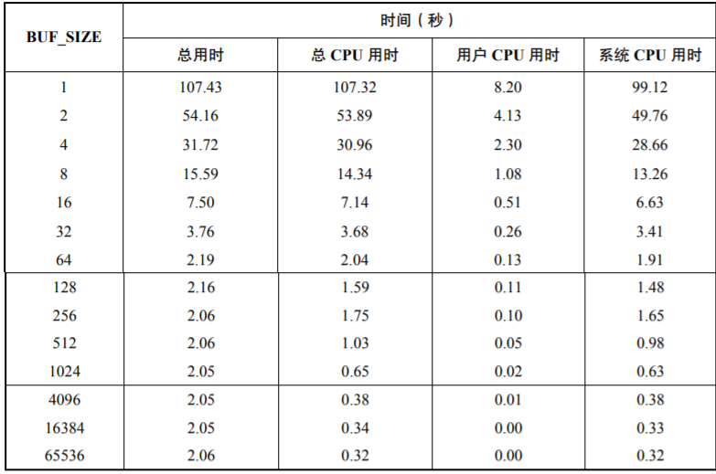
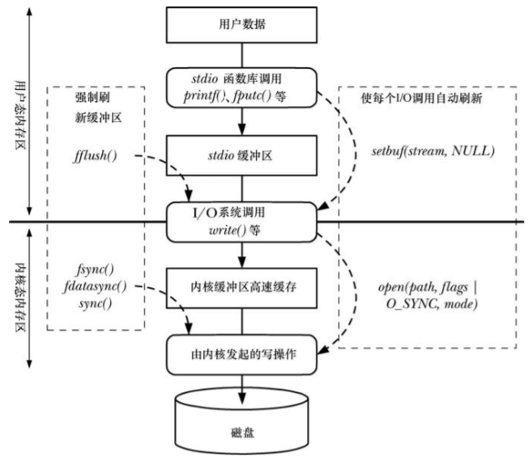

# 第13章 文件I/O缓冲

## 13.1 文件I/O的内核缓冲：缓冲区高速缓存

write()会把用户缓冲区的内容复制到内核缓冲区，内核会有计划的把内核缓存区中的数据写入硬盘。read()会把内核缓冲区的内容复制到用户缓冲区，内核会对数据进行预读。

* 缓冲区大小对I/O的影响（测试环境下的block大小为4096）

  

## 13.2 stdio库的缓冲

```c
# include <stdio.h>
//注意：必须在调用任何其他stdio函数之前调用
//buf为NULL，则stream会自动分配一个缓冲区，但不强制要求size作为缓冲区的大小
//buf非NULL，则buf和size作为缓冲区
//mode - _IONBF不对I/O进行缓冲。（立即进行I/O操作）
//mode - _IOLBF采用行缓冲。（遇到换行符进行实际I/O操作）
//mode - _IOFBF采用全缓冲。（填满buf之后进行实际I/O操作）
int setvbuf(FILE *stream, char *buf, int mode, size_t size);

//等价于setvbuf(fp, buf, (buf != NULL)?_IOFBF:_IONBF, BUFSIZ);
void setbuf(FILE *stream, char *buf);

//刷新stdio缓冲区
int fflush(FILE *stream);

# define _BSD_SOURCE
# include <stdio.h>
//等价于setvbuf(fp, buf, (buf != NULL)?_IOFBF:_IONBF, size);
void setbuffer(FILE *stream, char *buf, size_t size);
```

## 13.3 控制文件I/O的内核缓冲

```C
#include <unistd.h>
//当fd的高速缓存传递完成后，fsync()才会返回
int fsync(int fd);

//仅强制更新数据部分，不强制更新文件属性部分
int fdatasync(int fd);

//更新内核的所有缓冲区
void sync(void);

//O_SYNC：open()调用中的一个参数，等同于每次write()后执行fsync()
//O_DSYNC：仅强制更新数据部分，等同于每此write()后执行fdatasync()
//O_RSYNC：所有写操作落盘后，才可以开始读，结合O_SYNC和O_DSYNC使用时会有类似的表现。

//注意：sync类的操作，对系统性能消耗极大。
```

## 13.4 I/O缓冲模型



## 13.5 根据I/O场景向内核提出建议

内核可以感觉提出的建议优化I/O，但不是必须要根据这些建议进行操作。

```c
# define _XOPEN_SOURCE 600
# include <fcntl.h>
//fd：指定文件描述符
//offset：偏移量
//len：长度
//advice：建议
int posix_fadvise(int fd, off_t offset, off_t len, int advice);
```

* POSIX_FADV_NORMAL：默认：Linux中文件预读取窗口大小为128KB。
* POSIX_FADV_SEQUENTIAL：正序读取数据：Linux把预读取窗口扩展为默认的2倍。
* POSIX_FADV_RANDOM ：随机读取数据：Linux会禁用预读取。
* POSIX_FADV_WILLNEED：访问offset&len区域：内核把offset&len区域预先填充到高速缓冲中。
* POSIX_FADV_DONTNEED：不会offset&len区域：内核释放offset&len区域相关的缓存。
* POSIX_FADV_NOREUSE：一次性访问offset&len区域：内核把offset&len区域预先填充到高速缓冲中，访问后立即释放

## 13.6 绕过缓冲区高速缓存：直接I/O

open()时设置O_DIRECT标志位，可以绕过缓冲区。（用此可以实现 0 copy）

### 13.6.1 直接I/0的对齐限制

* 必须是块大小的整数倍。
* 数据传输的开始点（文件和设备的偏移量）必须是块大小的整数倍。
* 带传递数据的长度必须是块大小的整数倍。
* 注意：不遵守这个限制，会导致EINVAL错误

## 13.7 混合使用库函数和系统调用进行文件I/O

```C
# include <stdio.h>
int fileno(FILE *stream);		//FILE*转fd
FILE *fdopen(int fd, const char *mode);		//fd转FILE*
//注意：转换后要小心处理用户缓冲区和内核缓冲区，必要时要刷新缓冲区。
```


